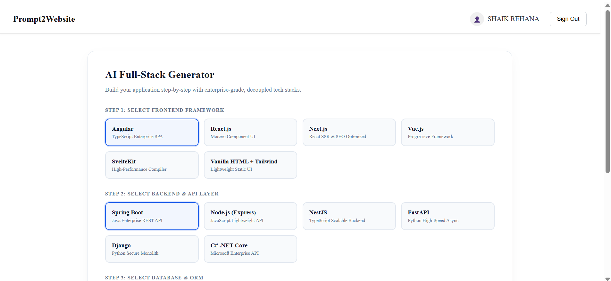
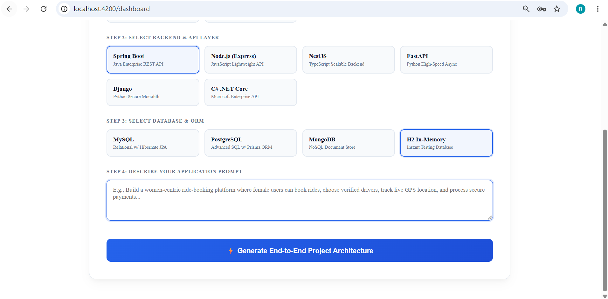
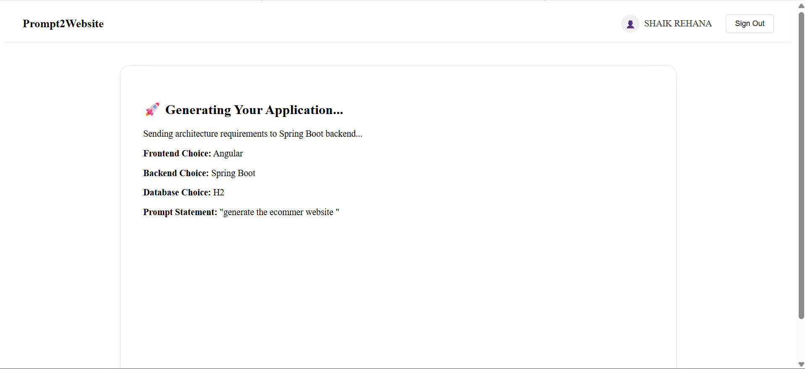

# 🚀 Prompt2Website

### AI-Powered Full-Stack Project Generator

**Prompt2Website** is a full-stack web application that transforms user requirements and selected technology stacks into a structured project architecture. The application combines an **Angular frontend** with a **Java Spring Boot backend** and **MySQL/H2 database integration** to provide an interactive project-generation workflow.

The project demonstrates practical implementation of **REST APIs, Spring Boot, Angular, database integration, validation, authentication, error handling, and full-stack application architecture**.

---

## 📌 Project Overview

Prompt2Website allows users to:

- Enter a project or business requirement using a natural-language prompt.
- Select preferred frontend, backend, and database technologies.
- Generate a structured project architecture based on the provided requirements.
- View the generated project structure through an interactive UI.
- Maintain project generation history through the backend.
- Communicate between Angular and Spring Boot using REST APIs.

The project demonstrates an end-to-end flow from **user input → Angular UI → REST API → Spring Boot service layer → database → structured response**.

---

## ✨ Key Features

### 👤 User Features

- 📝 **Prompt-Based Project Generation**
  - Enter business requirements or application ideas.
  - Generate a structured project architecture from the provided prompt.

- 🛠️ **Technology Stack Selection**
  - Select preferred frontend, backend, and database technologies.
  - Supports technology options configured within the application.

- 🌳 **Project Structure Visualization**
  - Displays the generated project structure in a structured file-tree format.

- 📜 **Project History**
  - Maintains project generation records through the backend.

- 🔐 **Authentication & Validation**
  - Handles user authentication and request validation.
  - Provides appropriate validation and error responses.

---

## 🏗️ System Architecture

```text
                    ┌──────────────────────────┐
                    │       User / Browser      │
                    └────────────┬─────────────┘
                                 │
                                 ▼
                    ┌──────────────────────────┐
                    │     Angular Frontend      │
                    │                          │
                    │  Components              │
                    │  Services                │
                    │  Forms                   │
                    │  HTTP Client              │
                    └────────────┬─────────────┘
                                 │
                          HTTP / REST APIs
                                 │
                                 ▼
                    ┌──────────────────────────┐
                    │    Spring Boot Backend   │
                    │                          │
                    │  REST Controllers        │
                    │          ↓               │
                    │  Service Layer           │
                    │          ↓               │
                    │  Repository Layer        │
                    └────────────┬─────────────┘
                                 │
                                 ▼
                    ┌──────────────────────────┐
                    │       Database           │
                    │                          │
                    │     MySQL / H2           │
                    └──────────────────────────┘
```

---

## 🔄 Application Flow

```text
User enters project requirement
              │
              ▼
Select Technology Stack
              │
              ▼
Angular Frontend
              │
              ▼
REST API Request
              │
              ▼
Spring Boot Controller
              │
              ▼
Service Layer
              │
              ▼
Project Generation Logic
              │
              ▼
Database / History
              │
              ▼
Structured API Response
              │
              ▼
Angular UI
              │
              ▼
Display Generated Project Structure
```

---

## 🛠️ Technology Stack

### Frontend

- Angular
- TypeScript
- HTML5
- CSS3
- Angular Forms
- Angular HttpClient

### Backend

- Java
- Spring Boot
- Spring MVC
- Spring Data JPA
- REST APIs

### Database

- MySQL
- H2 Database

### Development & Testing Tools

- Git
- GitHub
- Postman
- VS Code
- Maven

---

## 🧩 Backend Architecture

The Spring Boot backend follows a layered architecture:

```text
Prompt2website-backend/
│
└── src/
    └── main/
        └── java/
            └── com/prompt2website/backend/
                │
                ├── controller/
                │   └── REST API endpoints
                │
                ├── service/
                │   └── Business logic
                │
                ├── repository/
                │   └── Database operations
                │
                ├── model/
                │   └── Entities & request/response models
                │
                └── configuration/
                    └── Application configuration
```

### Request Flow

```text
Angular
   ↓
REST Controller
   ↓
Service Layer
   ↓
Repository
   ↓
MySQL / H2
   ↓
Response
   ↓
Angular UI
```

This layered approach helps maintain separation of concerns and keeps the backend modular and maintainable.

---

## 🎨 Frontend Architecture

```text
prompt2website-frontend/
│
└── src/
    └── app/
        │
        ├── components/
        │   └── dashboard/
        │
        ├── services/
        │   └── API communication
        │
        ├── models/
        │   └── Application data models
        │
        └── app.routes.ts
            └── Application routing
```

The Angular frontend communicates with the Spring Boot backend through HTTP-based REST APIs.

---

## 🔌 REST API Integration

The application follows a REST-based communication model between the frontend and backend.

Example flow:

```text
Angular Component
       │
       ▼
Angular Service
       │
       ▼
HTTP Request
       │
       ▼
Spring Boot REST Controller
       │
       ▼
Service Layer
       │
       ▼
Database
       │
       ▼
JSON Response
       │
       ▼
Angular UI
```

API endpoints can be tested and validated using **Postman**.

---

## 🧪 API Testing

Postman is used for testing backend REST APIs.

Testing includes:

- Request/response validation
- HTTP status code verification
- Request payload validation
- Error response testing
- Backend API debugging

---

## 📸 Screenshots

### 🏠 Prompt2Website Dashboard

> Add your actual dashboard screenshot here.

```markdown

```

---

### 🛠️ Technology Stack Selection

> Add your technology selection screenshot here.

```markdown

```

---

### 🌳 Generated Project Structure

> Add the generated project/file-tree screenshot here.

```markdown

```

---

### 📜 Project History

> Add your project history screenshot here.

```markdown

```

---

## 📁 Recommended Project Structure

```text
Prompt2Website/
│
├── prompt2website-frontend/
│   ├── src/
│   │   └── app/
│   │       ├── components/
│   │       ├── services/
│   │       ├── models/
│   │       └── app.routes.ts
│   │
│   └── package.json
│
├── Prompt2website-backend/
│   ├── src/
│   │   └── main/
│   │       ├── java/
│   │       └── resources/
│   │
│   └── pom.xml
│
└── README.md
```

---

# ⚙️ Getting Started

## 1️⃣ Clone the Repository

```bash
git clone <your-repository-url>
cd Prompt2Website
```

---

## 2️⃣ Start the Spring Boot Backend

Navigate to the backend:

```bash
cd Prompt2website-backend/backend
```

Run the application:

```bash
mvn spring-boot:run
```

The backend will start on the configured application port.

---

## 3️⃣ Start the Angular Frontend

Navigate to the frontend:

```bash
cd prompt2website-frontend
```

Install dependencies:

```bash
npm install
```

Start the Angular development server:

```bash
ng serve
```

Open the application in your browser using the configured frontend URL.

---

# 🧰 Useful Development Commands

### Install Angular Dependencies

```bash
npm install
```

### Start Angular Application

```bash
ng serve
```

### Build Angular Application

```bash
ng build
```

### Run Angular Tests

```bash
ng test
```

### Start Spring Boot Application

```bash
mvn spring-boot:run
```

---

# 🔐 Technical Highlights

- Java-based backend development using **Spring Boot**
- RESTful API development using **Spring MVC**
- Layered **Controller → Service → Repository** architecture
- Angular-based single-page application
- Database integration using **Spring Data JPA**
- MySQL/H2 database support
- Request validation and error handling
- REST API testing using **Postman**
- Frontend-backend integration using HTTP/JSON
- Git/GitHub-based version control
- Modular and maintainable project structure

---

# 🚀 Future Enhancements

Potential improvements for the project include:

- 🤖 Integration with a production-grade Generative AI model
- 📦 Downloadable project source-code generation
- 🔐 Enhanced authentication and role-based authorization
- ☁️ Cloud deployment
- 🐳 Docker containerization
- 🧪 Expanded automated test coverage
- 📊 Advanced project history and management
- 🔄 CI/CD pipeline integration

---

# 👩‍💻 About the Developer

**Shaik Rehana**

Java Full Stack Developer | Spring Boot | REST APIs | Angular | React.js | SQL

Focused on building full-stack applications using Java, Spring Boot, REST APIs, modern frontend technologies, and relational/NoSQL databases.

### Core Technologies

```text
Java • Spring Boot • REST APIs • Angular • React.js
SQL • MySQL • MongoDB • Git • GitHub • Postman
```

---

⭐ If you find this project useful, consider giving the repository a star!
